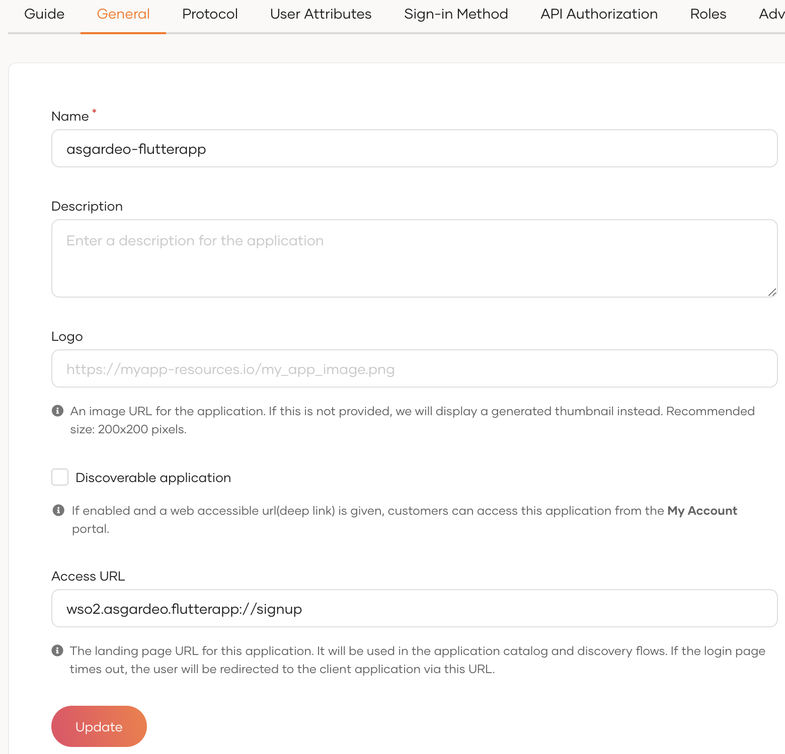

# Asgardeo Mobile Flutter Application
A Flutter mobile application integrated with Asgardeo. This can be used as a reference implementation to build a mobile application with Flutter. 
Developers can use this as a boilerplate to build an app from scratch or as a reference to find the respective code snippets

### Features
- User sign-up
- User sign-in
- Sign-out
- Secured External API calling
- Edit and view the user profile

## Prerequisites

### Install Flutter
Follow Flutter Installation [Documentation](https://docs.flutter.dev/get-started/install) to Install flutter.

This application is tested with Flutter version **3.10.4** and following versions of the dependencies

`http` 0.13.5

`flutter_appauth` 4.2.1

`webview_flutter` 4.2.2

These dependencies and the versions are available at *asgardeo-flutter-boilerplate-app/pubspec.yaml* file.

Compatible versions of the above dependencies may change with the Flutter version

### Setup IDE for Development
You can use one of the following IDEs for development

- Android Studio
- Intellij IDEA
- Visual Studio

### Setup Mobile Device or an Emulator
You can use one of the following options to try out the mobile application

- Connect your mobile device to the computer via USB and your OS will detect the plugged-in device. Make sure to enable development mode on your mobile device.
- Use Android Studio Emulator - If you have Android Studio installed then you can use this. 
- Use iPhone emulator in MacOS - If you have a Macbook, then you can install XCODE and use this emulator

## Setup the Asgardeo Application
1. Login to your [Asgardeo account](https://console.asgardeo.io/) . If you do not have a Asgardeo account, you can create one following the [documentation](https://wso2.com/asgardeo/docs/get-started/create-asgardeo-account/#sign-up).
2. Create a new Mobile Application in Asgardeo Console. You can follow the [documentation](https://wso2.com/asgardeo/docs/guides/applications/register-mobile-app/#register-the-app) for registering mobile app.
Make sure to put the *wso2.asgardeo.flutterapp://login-callback* as the redirect uri as showed in the screenshot.


3. Configure User attributes in the Application’s User Attributes tab.
   Make sure to select following user attributes
- Country attribute  in Address
- Mobile attribute in Phone
- First Name, Last Name, and Photo Url attributes in Profile


4. Add following scopes as the required scopes in the Application’s User Attributes tab.
   Required scopes:

openid address phone profile


5. In Application configuration's General tab add *wso2.asgardeo.flutterapp://signup* as the Access URL. 



## Getting started with the Mobile Application

1. Clone this Git repository.

`git clone https://github.com/Dinithi-Hasanika/Asgardeo-Flutter-APP.git`

2. Update configurations in the file `<project>/lib/configs/configs.dart` in the flutter project 

```
const clientId = '<Application-client_id>';
const redirectUrl = 'wso2.asgardeo.flutterapp://login-callback';
const organizationName = '<Asgardeo-organization-name>';
const spName = '<Application-name>';
const externalAPIEndpoint = '<external-api-url>';
const accessURL = 'wso2.asgardeo.flutterapp://signup'; // configured access URL

//optional
const defaultPhotoURL = '<default-photo-url>'
```

The specified default photo in the above configs will be shown in the user profile if the user has not added any photo URL.

3. Run following command to download the dependencies

`flutter pub get`

4. Run the flutter application with the following command in flutter terminal

`flutter run`