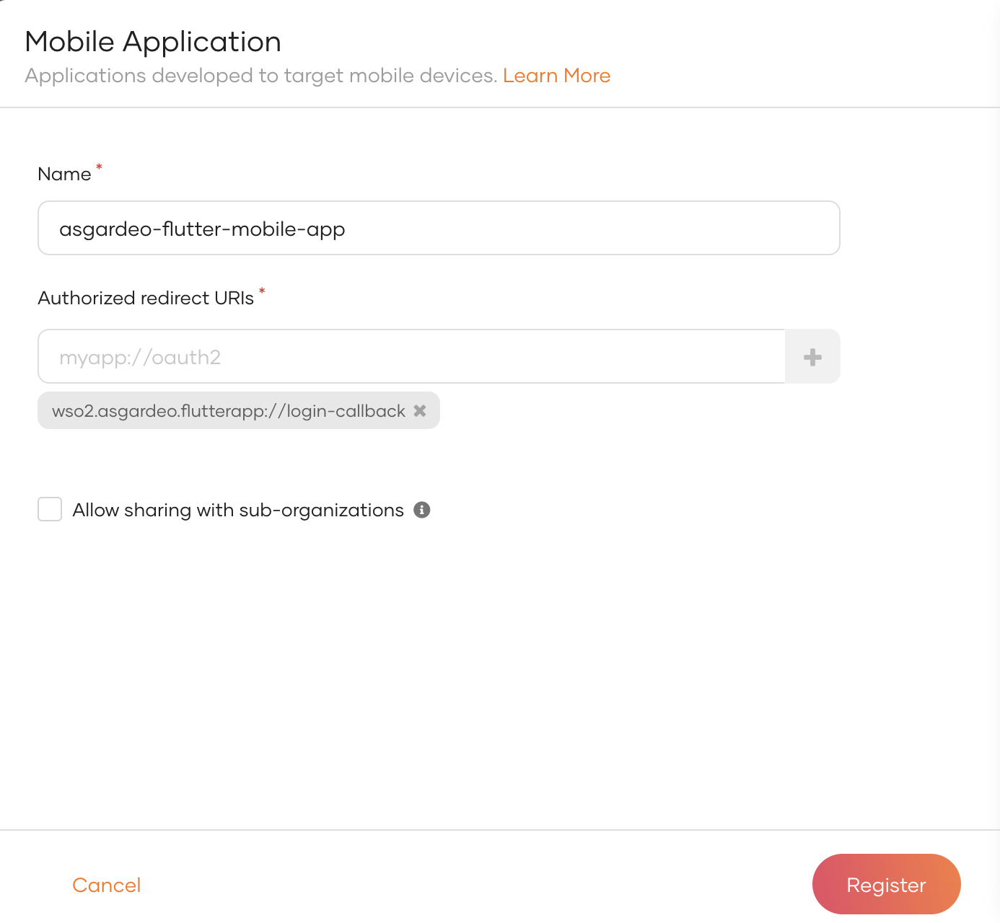
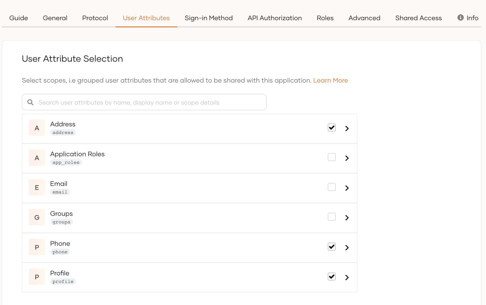
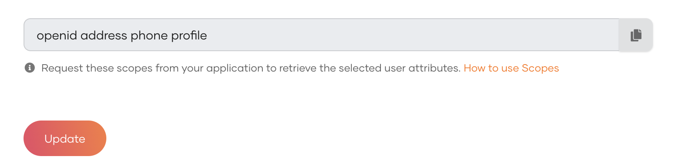

# Asgardeo Mobile Flutter Application

## Prerequisites

### Install Flutter
Follow Flutter Installation [Documentation](https://docs.flutter.dev/get-started/install) to Install flutter

### Set Up IDE for Development
You can use one of the following IDEs for development

- Android Studio
- Intellij IDEA
- Visual Studio

### Set Up Mobile Device or an Emulator
You can use one of the following options to try out the mobile application

- Connect your mobile device to the computer via USB and your OS will detect the plugged-in device. Make sure to enable development mode on your mobile device.
- Use Android Studio Emulator - If you have Android Studio installed then you can use this. 
- Use iPhone emulator in MacOS - If you have a Macbook, then you can install XCODE and use this emulator

## Setup the Asgardeo Application
1. Login to your [Asgardeo account](https://console.asgardeo.io/) . If you do not have a Asgardeo account, you can create one following the [documentation](https://wso2.com/asgardeo/docs/get-started/create-asgardeo-account/#sign-up).
2. Create a new Mobile Application in Asgardeo Console. You can follow the [documentation](https://wso2.com/asgardeo/docs/guides/applications/register-mobile-app/#register-the-app) for registering mobile app. Make sure to put the *wso2.asgardeo.flutterapp://login-callback* as the redirect uri as showed in the screenshot.



3. Configure User attributes in the Application’s User Attributes tab.
   Make sure to select following user attributes
- Country attribute  in Address
- Mobile attribute in Phone
- First Name, Last Name, and Photo Url attributes in Profile



4. Add following scopes as the required scopes in the Application’s User Attributes tab.
   Required scopes:

openid address phone profile



## Setup the Mobile Application

1. Clone the Git repository.
2. Update configurations in the file `<project>/lib/configs/configs.dart` in the flutter project 

```
const clientId = '<client_id>';
const redirectUrl = 'wso2.asgardeo.flutterapp://login-callback';
const organizationName = '<organization-name>';
const spName = '<sp-name>';
const externalAPIEndpoint = '<external-api-url>';
```
